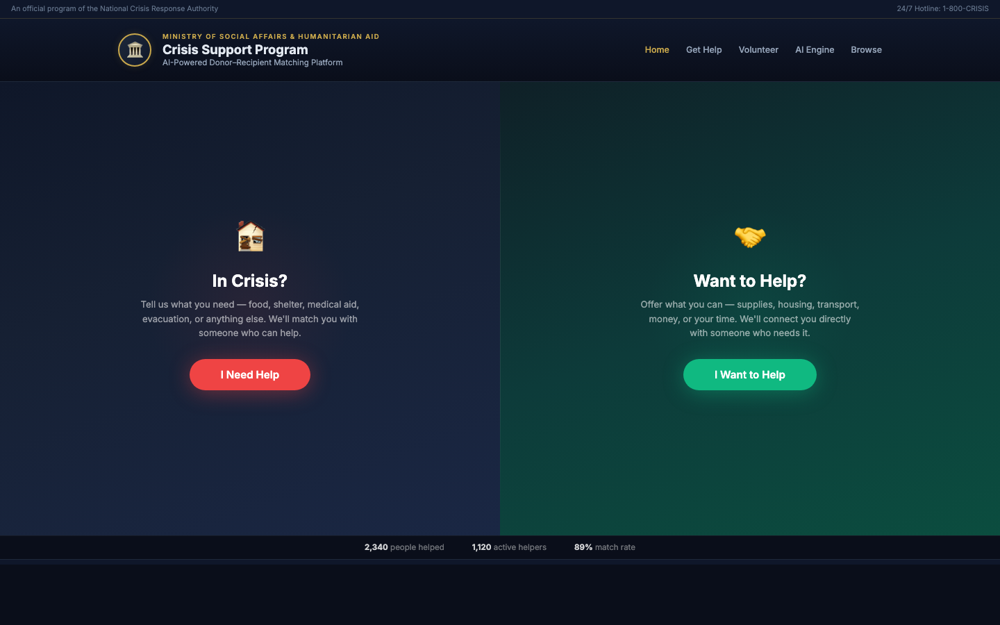

# 🕊️ Crisis Support Program

🔗 **Live:** [sameer-goel.github.io/crisis-support-program](https://sameer-goel.github.io/crisis-support-program/)

---

## Why this exists

### The Problem

During a crisis — war, disaster, displacement — two groups emerge in parallel:

- **People who urgently need help.** Food, shelter, medicine, evacuation, or simply someone to listen.
- **People who want to give help.** They have resources, time, empathy, a spare room, a skill, or money to donate.

Both groups exist in massive numbers. But they rarely find each other in time.

A mother in a shelter doesn't know that a family three blocks away has an empty room. A trained trauma counselor sitting at home doesn't know that someone an hour away is in acute distress right now. A donor with medical supplies has no idea which clinic ran out of insulin yesterday.

**The help exists. The need exists. The connection doesn't.**

### The Analysis

At its core, this is a **supply and demand problem** — but with stakes far higher than any marketplace.

- Supply is fragmented: thousands of volunteers, NGOs, and everyday citizens willing to help, each with different skills and capacity.
- Demand is invisible: those in crisis often can't navigate traditional bureaucracy, don't know what exists, or can't wait in queues.
- Traditional relief systems are slow, centralized, and one-size-fits-all.

What's missing is an intelligent layer that understands context — who needs what, who can offer what, when, where, and in what language — and matches them instantly.

### The Solution

**A Crisis Support Platform powered by an intelligent matching engine.**

Citizens describe their situation in plain words. Volunteers offer what they can. An AI engine reads both sides, understands emotional and practical context, and matches the right people to each other — fast, verified, and anonymous.

It mirrors how a thoughtful human coordinator would work, but at the scale of thousands of simultaneous cases.

---

## What's inside

| Page | Purpose |
|------|---------|
| **Home** | Split-screen entry point — one side for those in crisis, one for those who want to help |
| **Get Help** | Recipient flow — describe your situation, watch the AI find and schedule a match |
| **Volunteer** | Donor dashboard — see real-time needs, offer what you have |
| **Browse** | Search verified volunteers by skill, language, or availability |
| **AI Engine** | Live visualization of how the matching actually works |

## Run it

Open `index.html` in any browser. No build, no server, no dependencies.

---

*An official government-style initiative concept for connecting need with help during crisis.*
